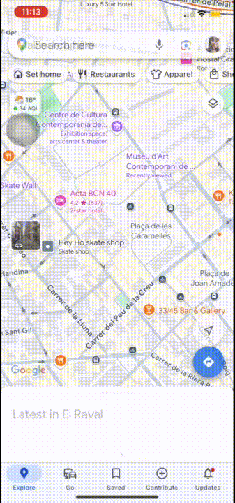

# citysoundtrack

What's a movie moment? 
any memory you had that made YOU feel like a main character. what song was playing in the background? what song do you associate with it? let me know in the app

## How to find coordinates for your location

1. Go to the Google Maps app
2. Tap on the approximate location
3. Scroll down on the pinned entry and tap the coordinates to copy to clipboard
4. The first number is your latitude
5. The second number is your longitude (don't forget the minus sign if present!)

1. Go to [Google Maps](https://www.google.com/maps)
2. Right click on your desired location
3. The coordinates will appear at the top of the menu
4. The first number is your latitude
5. The second number is your longitude (don't forget the minus sign if present!)
